# 3D Model (STL) Gear Generator

# Description

This is a web application for the purpose of generating custom 3D models (STL) of involute gears including:

* Spur Gear
* Helix Gear
* Double Helix Gear
* Bevel Gear
* Worm Gear

The user enters in the desired parameters on a form, and an STL as well as image representations of the gear are generated.

This web application also includes a SQL database that stores users past gear designs.

As well, this web application also includes a feature that calculates other parameters of the gears and a matching/meshing gear of given
a desired pitch diameter.


# Dependencies
This web application was designed for a Windows PC, however, modifications can be made for this to operate on another OS.

This web application requires the following dependencies:

* FreeCAD  
* Python 3.9
* Python packages as defined in requirements.txt


# Installation

The installation requires a few steps, but are easy.


## Step 1: Install FreeCAD

Install FreeCAD at https://www.freecadweb.org/ anywhere in "C:\Program Files"

In order to work with the gears after installing FreeCAD run the FreeCAD GUI application. Make sure to go to Tools on the ribbon bar, and then select Add-on Manager. This will open a dialog box and then navigate to "fcgear" in Wrokbenches tab and choose "fcgear". Then click on Install/update selected. This will install the external gear generation and modification setup. 

To check if it installed correctly go to the top of the FreeCAD GUI and click on the Start drop down and then check if there is an option that says "Gear".

If you are unable to follow these steps, there is a link to help you walkthrough it.
https://wiki.freecadweb.org/FCGear_Workbench click on this link and go to installation.

_The last step is an important one as without this no gear would be generated despite having FreeCAD installed._

If you would like to install elsewhere, you must modify the code in <span>routes.py</span>

You can adjust the search by replacing "C:\Program Files" with the path that FreeCAD is installed in

```python
for root, dir, files in os.walk(r"C:\Program Files"):
      if "FreeCADCmd.exe" in files:
         freecad = os.path.join(root, "FreeCADCmd.exe")
         break
         
if freecad:
    print(f"Found FreeCadCmd.exe at {freecad}")
    
else:
    raise OSError("Can't find FreeCADCmd.exe")
```

## Step 2: Install Python

Install Python: https://www.python.org/downloads/

Install PIP, the python package installer: https://pip.pypa.io/en/stable/installation/

<br />

## Step 3: Install Python Requirements

Navigate to the /requirements and open the terminal/console within this folder.

Then install the requirements with this command in the terminal:

```console
pip install -r requirements.txt
```


## Step 4: Check System Environment Variables

Check the System Environment Variables for a variable called FLASKAPP

If this exists, you must remove/delete this variable as it may have been automatically been added
while installing python dependencies.

To access windows system environment variables, in the window ssearch, search for "system environment variables"

You should see the setting "Edit System Environment Variables".

This can also be accessed in the Controls Panel.

The configurations of this app has already automatically handled the FLASKAPP environment variables, but first requires
any FLASKAPP variables within the system to be removed.


## Step 5: Setting up SQL Database

This web application uses a SQL database to store past user gear design history.

To set up the SQL database, open the terminal in the root folder, then type the following commands in order:

```console
flask db init
```

```console
flask db migrate
```

```console
flask db upgrade

```

## Installation Complete!

Congratulations. You have finished the installation.

# Launching the web application

Open the terminal in the root folder, then issue this command:

```consnole
flask run
```

This will load the web application and give you the url which your browser can use to access the web application.

The terminal output should appear as follows:

```console
 * Serving Flask app 'web_app.py' (lazy loading)
 * Environment: development
 * Debug mode: on
Found FreeCadCmd.exe at C:\Program Files\FreeCAD 0.19\bin\FreeCADCmd.exe
WebSocket transport not available. Install simple-websocket for improved performance.
C:\Users\adam\AppData\Local\Packages\PythonSoftwareFoundation.Python.3.9_qbz5n2kfra8p0\LocalCache\local-packages\Python39\site-packages\flask_socketio\__init__.py:596: Warning: Silently ignoring app.run() because the application is run from the flask command line executable. Consider putting app.run() behind an if __name__ == "__main__" guard to silence this warning.
  app.run(host=host, port=port, threaded=True,
 * Restarting with stat
 * Debugger is active!
 * Debugger PIN: 864-294-024
 * Running on http://127.0.0.1:5000/ (Press CTRL+C to quit)
Found FreeCadCmd.exe at C:\Program Files\FreeCAD 0.19\bin\FreeCADCmd.exe
WebSocket transport not available. Install simple-websocket for improved performance.
```

And thus, http://127.0.0.1:5000/ would be the url for this instance

Enter the Url in your browser, and you are done!


# Screenshots & Demonstration

## Front Page 
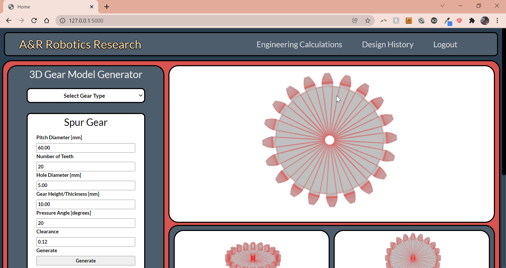

## User Registration
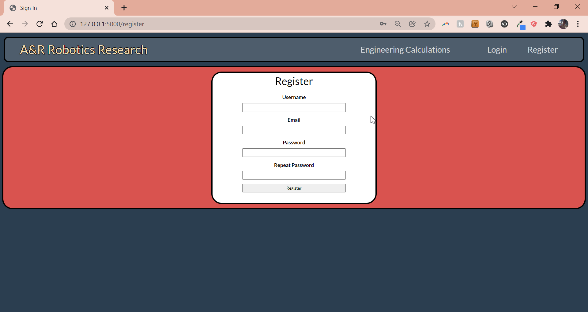

## User Login
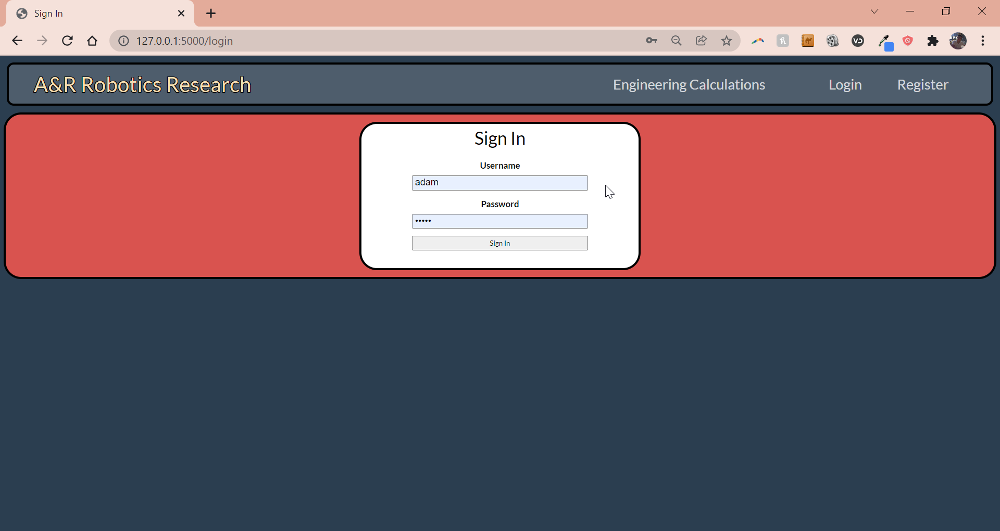

## Main Page User Design History
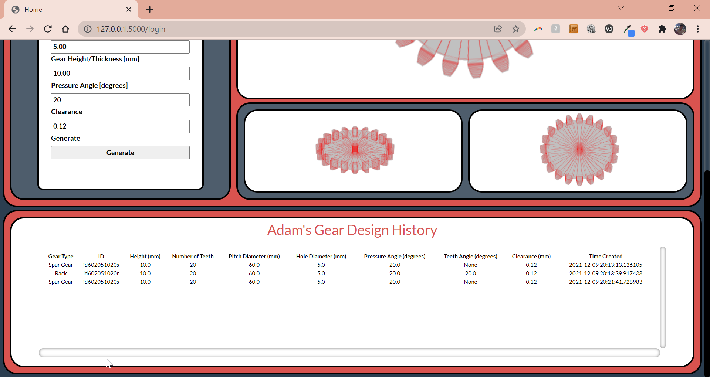

## Example Generating Bevel Gear
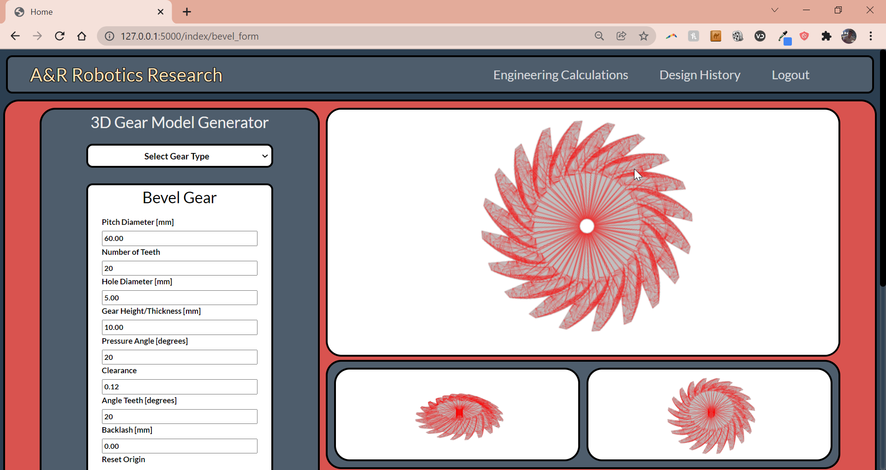

## Downloading Gear
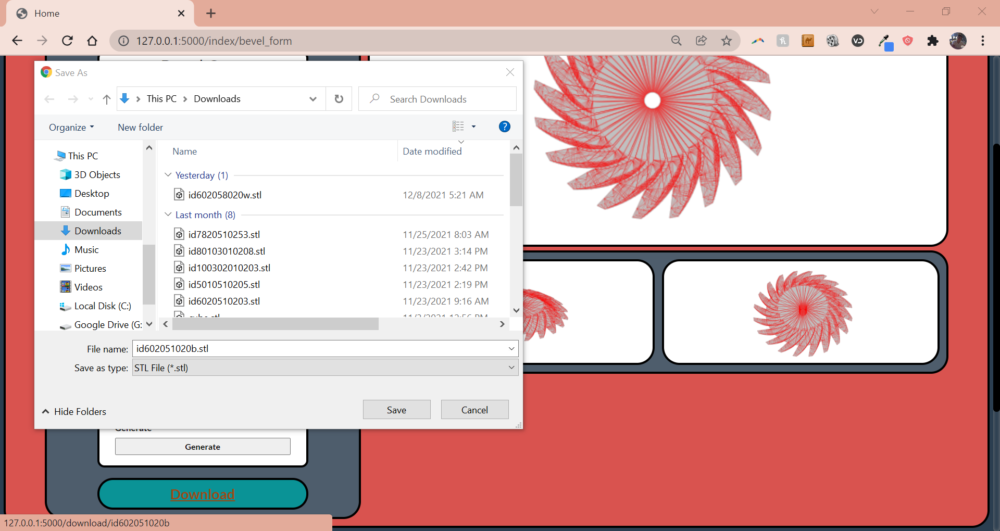

## Opening STL file
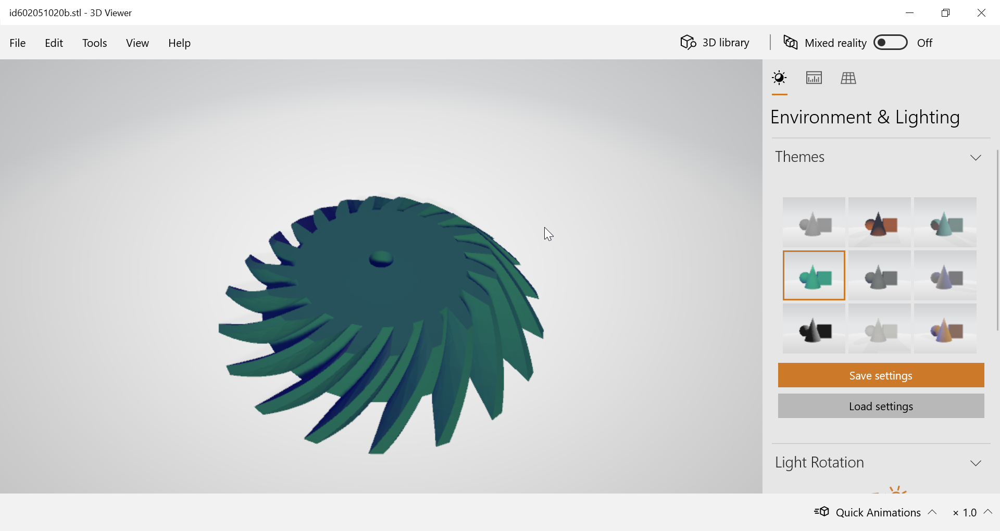

## Gear Calculations
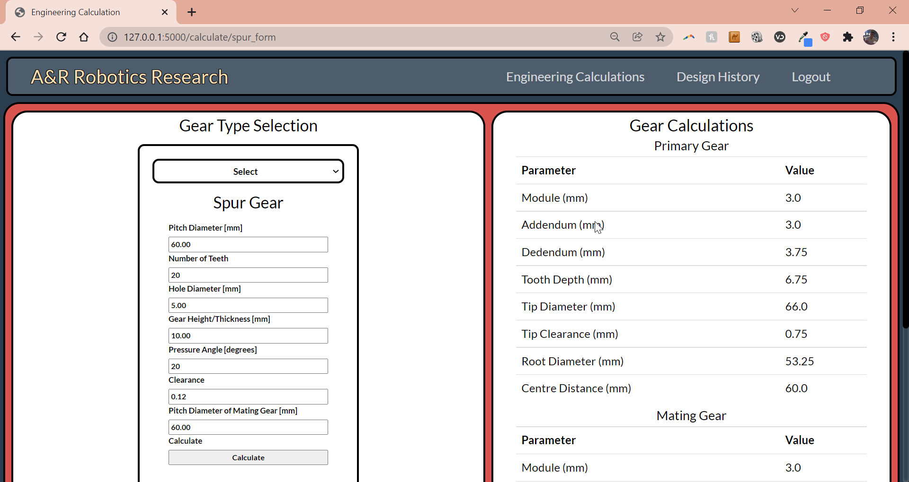
## Help

If there are any errors raised due to a corrupted or missing database, do the following:

1) Delete current database files: app.b and /migrations from the root folder

2) Open up the terminal in the root folder and enter the following commands:

```console
flask db init
```

```console
flask db migrate
```

```console
flask db upgrade
```

These actions removes the current database and reinitializes a new database

## Authors

Adam Nguyen:
* Student ID: 47505102
* Email: 
    * avnguyen213@gmail.com
    * avnguyen@student.ubc.ca

Rishabh Goel:
* Student ID: 81514283
* Email: 
    * rgoel6157@gmail.com
    * goel1996@student.ubc.ca 

## Version History

* 1.0


## License

N/A

## Acknowledgments

* This web application also uses a custom python module called STL-to-gif and is written by daniel aguirre:
    * https://github.com/DAguirreAg/STL-to-gif
* FreeCAD Application + Community


# Class Heirarchy Diagrams

This section shows the internal structure of the files and the classes used in this project

## Forms Heirarchy Diagram
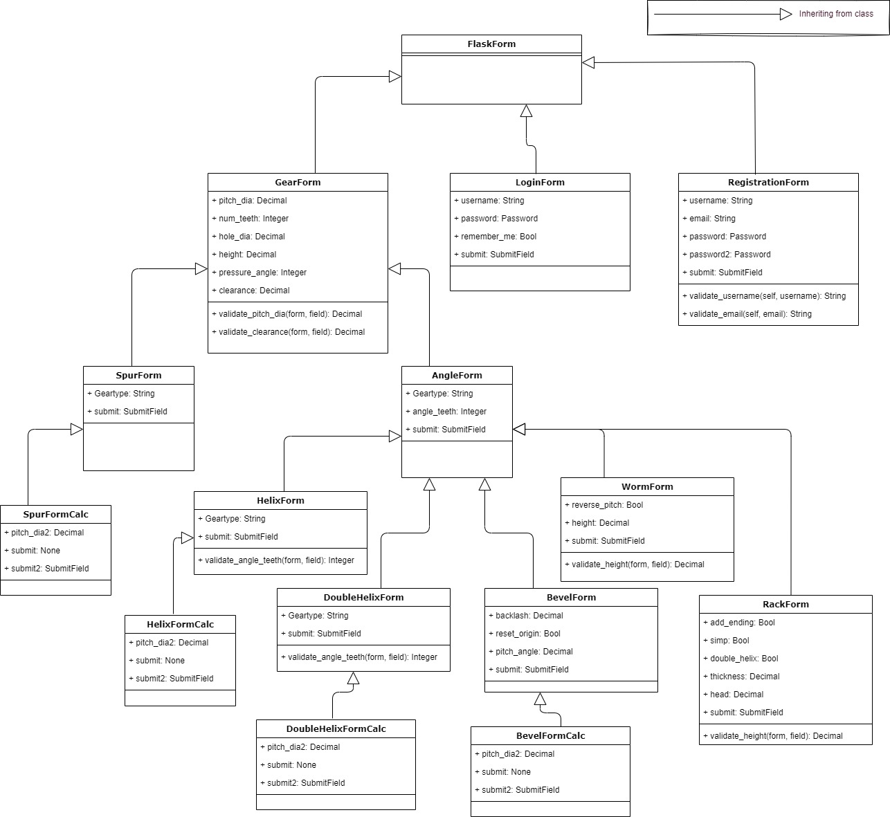

## Gear types Heirarchy Diagram
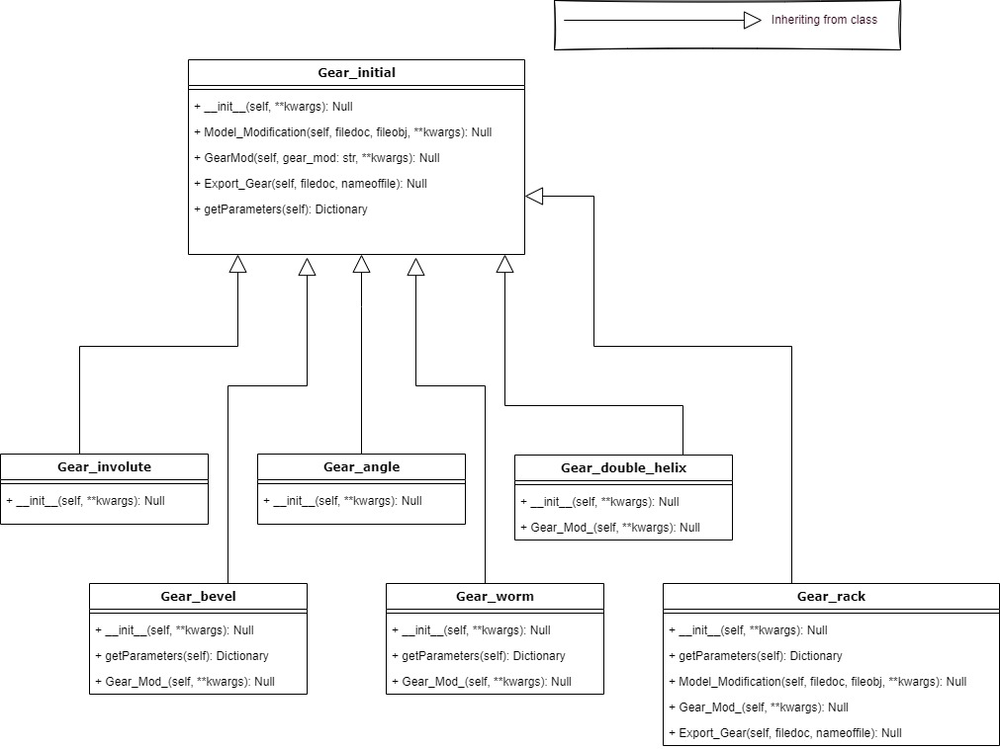

## Gear Heirarchy Diagram
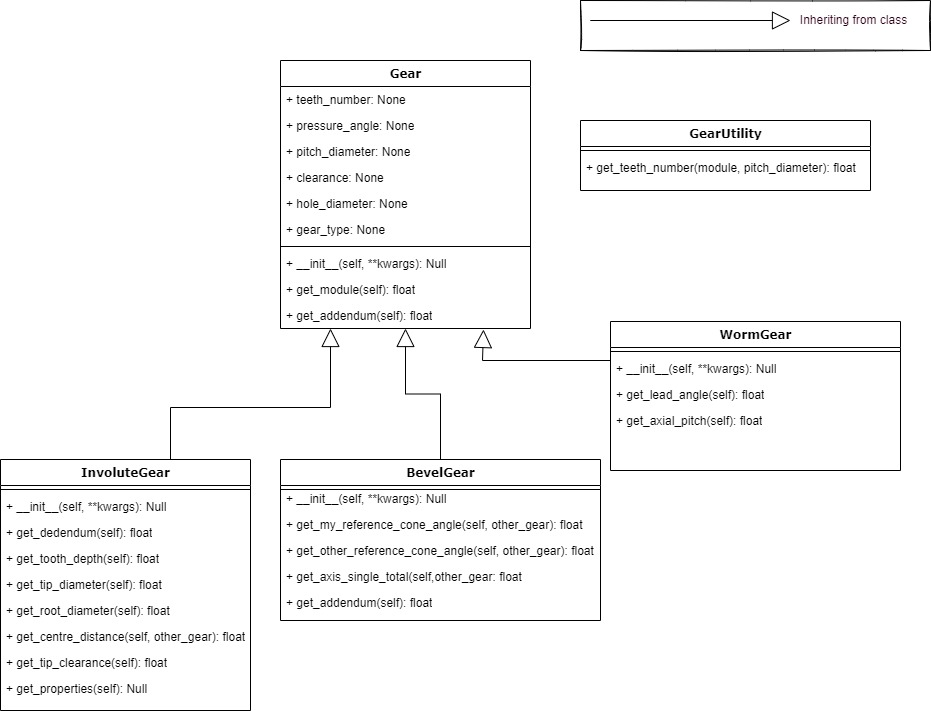

## Model Heirarchy Diagram
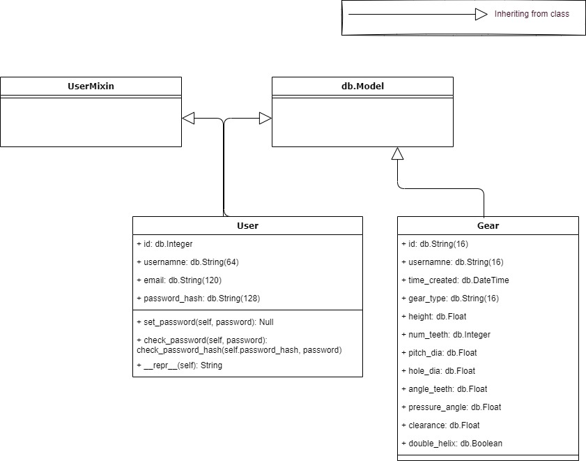

## Heirachy Structure and Flow of the Entire Project 
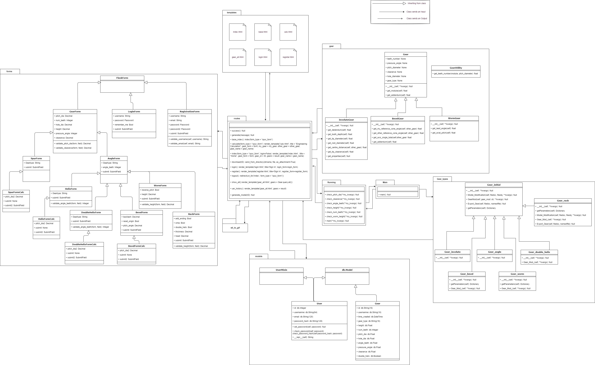
